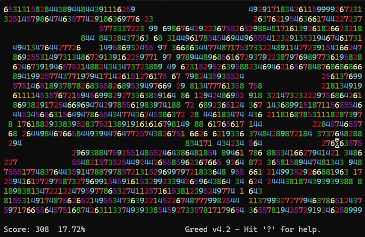

# Stuck Game - Discrete Mathematics II Programming Assignment 1

## 📌 Overview

This project is a **graph-based movement game** where students implement a strategy to **minimize the number of moves** in a grid-based game. The player starts at a **given position** and moves according to the **rules of movement**, avoiding deleted squares and walls.

Each student must create a **Java class** that extends `Player.java` and implements the `nextMove()` method to determine their movement strategy.

## 📂 Project Structure

```
StuckGame/
│── src/
│   ├── game/
│   │   ├── Board.java             # Game board logic
│   │   ├── Move.java              # Represents a move in the game
│   │   ├── Player.java            # Abstract base class for students
│   │   ├── Referee.java           # Handles game execution and validation
│   │   ├── InstanceGenerator.java # Generates random game instances
│   │   ├── GameLogger.java        # Logs game results
│   │   ├── Tester.java            # Runs student submissions
│   ├── players/
│   │   ├── Player12345.java       # A player
│   │   ├── Player67890.java       # Another player
│   │   ├── ...                    # other players...
│── students.txt                   # List of student IDs
│── boards/                        # Stores game instances for fair testing
│── results/                       # Stores game results per player
│── snapshots/                     # Stores game step-by-step visual logs (optional)
│── run_tests.sh                   # Automates compilation and execution
│── README.md                      # This file
```

## 🎮 **Game Rules**

### **🔢 Grid Layout**

* The game takes place on an **N × N** board with each cell containing a **number (1-9)**.
* The **starting position** of the player is **randomly chosen** for each test.
* The **goal** is to **get stuck with as few moves as possible**.

### **🔄 Movement Rules**

1. **The player moves in one of 8 directions:**

   * **N, S, E, W (↑ ↓ → ←)**
   * **NW, NE, SW, SE (↖ ↗ ↙ ↘)**
2. Your submitted code must return a move direction (N, NE, E, SE, S, SW, W, NW) as a `Move`. **The movement distance is determined by the first number in that direction.**
3. **A move is valid only if:**

   * The player can really move towards the target direction without going out of the boundaries or crosses a previously visited (thus deleted) square.
   * The player does not pass through or land on a **deleted cell** (visited cells are treated as obstacles).
4. **Cells traversed during a move are deleted (replaced by `" "`).**
5. **The game ends when no valid moves remain.**

## 📌 **Submission Instructions**

* **DO NOT** push your `Player<yourStudentID>.java` file to this repository.
* Submit your `Player<yourStudentID>.java` file through **the designated submission system** (e.g., email, Moodle, Google Classroom).
* Your filename must be **exactly** `Player<yourStudentID>.java`.
* Your submission will be tested on multiple board instances stored in `boards/`.
* Any unauthorized access or sharing of solutions will be considered plagiarism.

## 📌 **Example Submission (`Player12345.java`)**

```java
package players;

import game.*;
import java.util.List;

public class Player12345 extends Player {
    public Player12345(Board board) {
        super(board);
    }
    
    @Override
    public Move nextMove() {
        List<Move> possibleMoves = board.getPossibleMoves();
        return possibleMoves.isEmpty() ? null : possibleMoves.get(0); // Always pick first move
    }
}
```

## 📌 **Running the Tests**

### **Option 1: Run Manually**

```sh
javac -d bin src/game/*.java src/players/*.java
java -cp bin game.Tester
```

### **Option 2: Use the Automated Script**

```sh
chmod +x run_tests.sh  # (Only needed once)
./run_tests.sh         # Runs the script
```

* The script **compiles all Java files** and executes each player's code.
* Game instances are pre-generated in the `boards/` directory.
* Results will be stored in `results/Player<studentID>.log`.
* A summary of scores will be stored in `results/TotalScores.txt`.
* Step-by-step game snapshots (if enabled) will be saved in `snapshots/`.

## 📌 **Rules & Guidelines**

### **✅ Do's**

✔ **To learn** you can install the game **greed** on any linux terminal (or wsl) \[`sudo apt install greed` etc.] and play with it. See the screenshot below.
✔ **Implement** your own unique strategy.
✔ **Follow** the movement rules strictly.
✔ **Test** your code before submitting.
✔ **Timeout limits:**

* Constructor Timeout (≥2 sec) Fails immediately. Player gets a score of 1 for the board.
* Move Timeout (≥1 sec per move) Stops playing after timeout, retains partial score.



### **❌ Don'ts**

❌ **Modify game logic files (`Board.java`, `Referee.java`, etc.).** If you believe there is an issue or a potential improvement, please report it to the instructor or submit a pull request with a suggested fix.
❌ **Try to access other students' submissions or plagiarize.**

## 📌 **Scoring & Evaluation**

* Your **score** is the **100 - 5 x movePenalty** where **movePenalty = MinSteps-YourSteps**.
* **Lower scores indicate better strategies** in terms of getting trapped quickly.
* If your program **makes an invalid move**, the game **immediately ends**, and your final score would be **minimal participation score of 1**.
* If your program **fails to compile**, your score will be **zero**. Make sure your submission compiles and runs correctly before submitting.
* If your program **crashes at runtime**, you will receive a **minimal participation score of 1**.
* If your program **exceeds the time limit** while making a move, the game ends immediately, and your score remains at that step.
* If your program **takes too long to initialize**, it will be disqualified, and your score will be **zero**.
* Your final score will be **reported as a percentage**, calculated as:

  ```
  Final Score = Average of your scores across all test boards
  ```

  The average percentage score across multiple board sizes will be used for evaluation.

## 📌 **Contact**

For any issues, contact the instructor or the teaching assistant.
